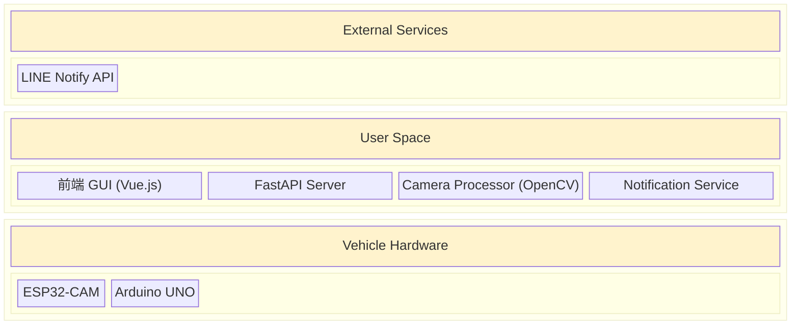

# Miniauto 專案

## 專案概述

Miniauto 是一個基於 Arduino UNO 和 ESP32-CAM 的小型自動化車輛專案。它整合了遠端手動控制、基於感測器的自主行為、即時影像串流與分析，以及事件驅動的 LINE 通知功能，形成一個完整且分層的物聯網系統。

## 系統架構

本系統採用現代化的分層式架構，將硬體控制、網路通訊和高階應用程式邏輯明確分離，以提高系統的穩定性、可擴充性和可維護性。


### 核心組件職責

1.  **Arduino UNO (硬體控制器)**:
    *   **核心職責**: 專注於所有即時的底層硬體控制與感測，包括馬達、LED、蜂鳴器、熱像儀和超音波感測器。
    *   **通訊**: 作為 **I2C 主機**，與 ESP32 交換感測器數據和控制指令。

2.  **ESP32-CAM (網路代理 & 視覺模組)**:
    *   **核心職責**: 作為 UNO 的協同處理器，處理所有網路通訊，並提供即時影像串流。
    *   **通訊**: 作為 **I2C 從機** 與 UNO 通訊，並作為 **HTTP 客戶端** 與後端伺服器同步數據。

3.  **Python FastAPI (後端/大腦)**:
    *   **核心職責**: 作為系統的中央大腦，託管高階應用程式邏輯、API 服務及使用者介面。
    *   **功能**: 提供 RESTful API、代理並分析影像串流、根據控制模式（手動、避障、自主）生成決策、觸發 LINE 通知。

4.  **前端 GUI (Vue.js)**:
    *   **核心職責**: 提供使用者互動介面，將使用者操作轉換為對後端 API 的呼叫，並顯示來自後端的影像串流和數據。

## 主要功能與特色

*   **分層式架構**: 清晰的職責分離，使系統更易於開發和維護。
*   **非同步控制流**: 前端發送的指令不會阻塞，而是由後端儲存狀態，再由硬體定期拉取，提高了系統的響應性和穩定性。
*   **後端影像代理與分析**: 所有影像串流都經過後端代理，便於集中進行影像分析（如 OpenCV 障礙物偵測），並將結果與串流一同提供給前端。
*   **多模組通訊**: 整合了 HTTP、I2C、UDP（用於服務發現）等多種通訊協議。
*   **事件驅動通知**: 能夠根據感測器數據（如熱像儀溫度）觸發即時的 LINE Notify 警報。

## 設定與運行

1.  **硬體設定**: 確保 Arduino UNO、ESP32-CAM 及所有感測器和致動器均已正確連接。詳細的硬體規格請參考 `docs/HardwareSpecification_V3.md`。
2.  **Wi-Fi 設定**: 在 `src/miniauto/arduino_uno/arduino_uno.ino` 和 `src/miniauto/esp32_cam/esp32_cam.ino` 中設定您的 Wi-Fi SSID 和密碼。
3.  **安裝依賴**: 在您的主機上，安裝 Python 和所有必要的函式庫：
    ```bash
    pip install -r requirements.txt
    ```
4.  **運行後端伺服器**:
    ```bash
    python main.py
    ```
    伺服器將在 `http://0.0.0.0:8000` 上啟動。
5.  **訪問 GUI**: 在瀏覽器中打開後端伺服器的 IP 位址，即可看到控制介面。

詳細的 API 呼叫流程、系統架構和後端工作流程，請參考 `docs/` 目錄下的相關文件。
