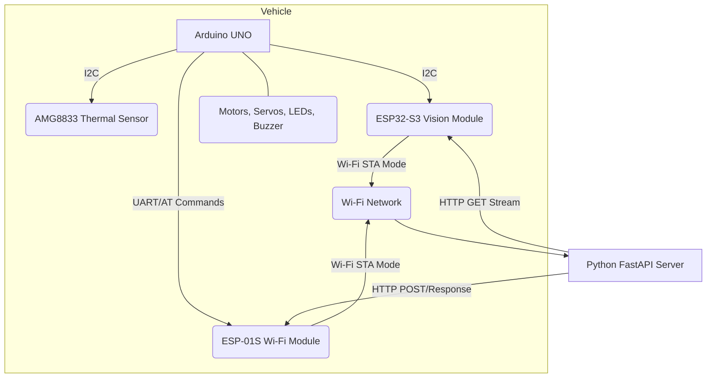

# Miniauto 專案

## 專案概述

Miniauto 是一個基於 Arduino UNO 和 ESP32-S3 的小型自動化車輛專案。它旨在實現車輛的遠端控制、環境感知（熱成像、視覺）以及與後端應用程式的數據同步。

## 系統架構

本系統採用分散式架構，主要由三個核心組件構成：

1.  **Arduino UNO + ESP-01S (主控/感測模組)**
    *   **角色:** 車輛的中央控制器，負責硬體驅動（馬達、舵機、LED、蜂鳴器）、感測器數據採集（熱成像、電壓）以及與後端伺服器的通訊。
    *   **通訊:** 透過 ESP-01S Wi-Fi 模組以 **STA 模式** 連接至指定 Wi-Fi 網路，並與後端伺服器進行雙向數據同步。
    *   **感測器:** 整合 AMG8833 熱成像感測器。
    *   **指令:** 接收來自後端伺服器的控制指令。

2.  **ESP32-S3 (視覺模組)**
    *   **角色:** 專用的視覺處理單元，負責採集影像並提供影像串流服務。
    *   **通訊:** 以 **STA 模式** 連接至與 Arduino UNO 相同的 Wi-Fi 網路，並啟動一個 Camera Stream Server。
    *   **IP 發現:** 作為 I2C 從機，回應 Arduino UNO 的 IP 位址請求，以便後端伺服器能動態獲取其串流位址。

3.  **Python FastAPI Server (後端/Py Agent)**
    *   **角色:** 系統的中央指揮與數據處理中心。
    *   **通訊:**
        *   接收來自 Arduino UNO 的車輛狀態（包括熱成像數據）。
        *   向 Arduino UNO 發送控制指令。
        *   作為客戶端，主動連接 ESP32-S3 的 Camera Stream Server 以獲取影像串流。
    *   **功能:** 數據分析、控制決策、影像處理等。



## 程式碼區塊說明

### `arduino_client.ino` (Arduino UNO 韌體)

這是運行在 Arduino UNO 上的核心韌體，負責車輛的實時控制和數據同步。

*   **Wi-Fi 通訊 (`SoftwareSerial` & AT 指令):**
    *   使用 `SoftwareSerial` 庫與 ESP-01S 模組進行 UART 通訊。
    *   透過發送 AT 指令來控制 ESP-01S 連接 Wi-Fi 網路、建立 TCP 連線並發送 HTTP 請求（POST）。
    *   `sendAtCommand()`: 基礎函式，用於發送 AT 指令並等待回應。
    *   `setupEsp01s()`: 初始化 ESP-01S 模組，使其連接到 Wi-Fi 網路。
    *   `httpPost()`: 發送 HTTP POST 請求到後端伺服器，並回傳伺服器回應的 Body。

*   **狀態收集與優化 (`status_byte`):**
    *   `status_byte` (uint8_t): 一個 8 位元的狀態字節，用於高效傳輸車輛的關鍵狀態。
        *   **Bit 0 & 1 (電量等級):** 2 位元，表示電池電量區間 (Critical, Low, Okay, Healthy)。
        *   **Bit 2 (熱感應器狀態):** 1 位元，表示 AMG8833 感測器是否正常。
        *   **Bit 3 (視覺模組狀態):** 1 位元，表示 ESP32-S3 視覺模組是否正常。
        *   **Bit 4 & 5 (錯誤代碼):** 2 位元，表示系統錯誤類型 (No Error, Comm Error, Sensor Error, Motor Error)。
        *   **Bit 6 & 7 (LED 燈號指示):** 2 位元，表示 LED 的高階狀態 (Off, Green, Red, Blue)，具有優先級。
    *   `getBatteryLevelCode()`: 讀取類比電壓，轉換為百分比和 2 位元電量代碼。
    *   `getErrorCode()`: 判斷並回傳 2 位元錯誤代碼 (待完善)。
    *   `getLedStatusCode()`: 根據優先級邏輯 (未連線 > 錯誤 > 忙碌 > 正常) 判斷 LED 狀態碼。

*   **核心同步邏輯 (`syncWithServer()`):**
    *   `loop()` 函式定時呼叫 `syncWithServer()`。
    *   `syncWithServer()` 負責收集所有狀態、打包 `status_byte`、收集熱成像數據（每秒一次）、構建優化後的 JSON 酬載，並透過 `httpPost()` 發送到後端 `/api/sync` 端點。
    *   同時，它解析後端的回應，並為執行控制指令（馬達、舵機、蜂鳴器、LED）預留框架。

*   **LED 控制 (`FastLED`):**
    *   整合 `FastLED` 庫來控制 WS2812 RGB LED。
    *   `Rgb_Show()`: 設定 LED 的 RGB 顏色。
    *   `setLedStatus()`: 根據 2 位元狀態碼設定 LED 顏色。

### `esp32_cam_stream_server.ino` (ESP32-S3 韌體)

這是運行在 ESP32-S3 上的韌體，負責影像採集和 IP 回報。

*   **Wi-Fi 連線:**
    *   以 **STA 模式** 連接至指定 Wi-Fi 網路。
*   **Camera Stream Server:**
    *   啟動一個 HTTP 伺服器，在 `/stream` 路徑提供 MJPEG 影像串流。
*   **I2C 從機功能:**
    *   作為 I2C 從機 (地址 `0x53`)，監聽來自 Arduino UNO 的請求。
    *   `sendIpAddress()`: 當收到請求時，回傳自身的本地 IP 位址。

### `main.py` (Python FastAPI Server)

這是運行在主機上的後端應用程式。

*   **FastAPI 框架:**
    *   使用 FastAPI 構建 RESTful API。
    *   動態載入 `apis` 目錄下的路由。
*   **同步端點 (`/api/sync`):**
    *   **待實作:** 接收來自 Arduino UNO 的車輛狀態和熱成像數據。
    *   **待實作:** 根據接收到的數據或控制邏輯，生成並回傳控制指令給 Arduino UNO。
*   **相機註冊端點 (`/api/register_camera`):**
    *   **待實作:** 接收來自 Arduino UNO 回報的 ESP32-S3 IP 位址。
*   **影像串流處理:**
    *   `CameraStreamProcessor`: 負責連接 ESP32-S3 的影像串流，並進行影像處理（例如 OpenCV）。

## 設定與運行

### Wi-Fi 設定注意事項

本專案中的所有 Wi-Fi 模組（ESP-01S 和 ESP32-S3）都預設連接到 SSID `Hcedu01`。

**重要：** 由於安全協議，Wi-Fi 密碼未硬編碼在程式碼中。您需要手動修改以下檔案中的 `password` 變數，將其替換為您實際的 Wi-Fi 密碼：

*   `arduino_client.ino`
*   `esp32_cam_stream_server/esp32_cam_stream_server.ino`

### 運行 Python FastAPI Server

1.  **安裝依賴:**
    ```bash
    pip install -r requirements.txt
    ```
2.  **運行伺服器:**
    ```bash
    python main.py
    ```
    伺服器將在 `http://0.0.0.0:8000` 上啟動。

### 燒錄韌體

1.  **Arduino UNO:**
    *   使用 Arduino IDE 打開 `arduino_client.ino`。
    *   選擇正確的板卡 (Arduino Uno) 和序列埠。
    *   燒錄韌體。
2.  **ESP32-S3:**
    *   使用 Arduino IDE 或 PlatformIO 打開 `esp32_cam_stream_server/esp32_cam_stream_server.ino`。
    *   選擇正確的板卡 (例如 ESP32-S3 Dev Module) 和序列埠。
    *   燒錄韌體。

## 待辦事項

請參考 `todo_list.txt` 檔案，其中包含了詳細的待辦事項清單。