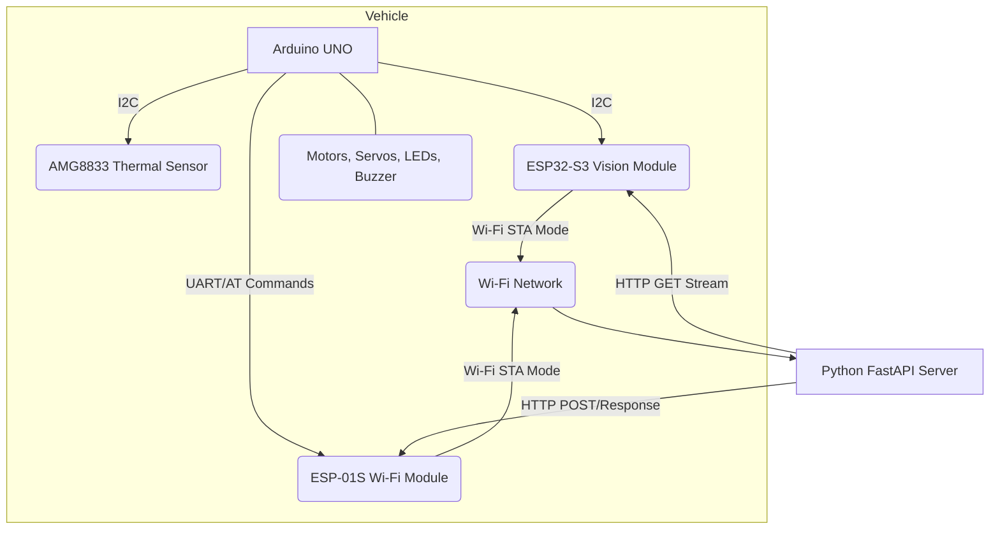

# Miniauto 專案

## 專案概述

Miniauto 是一個基於 Arduino UNO 和 ESP32-S3 的小型自動化車輛專案。它旨在實現車輛的遠端控制、環境感知（熱成像、視覺）以及與後端應用程式的數據同步。

## 系統架構

本系統採用分散式架構，主要由三個核心組件構成：

1.  **Arduino UNO + ESP-01S (主控/感測模組)**
    *   **角色:** 車輛的中央控制器，負責硬體驅動（馬達、舵機、LED、蜂鳴器）、感測器數據採集（熱成像、電壓）以及與後端伺服器的通訊。
    *   **通訊:** 透過 ESP-01S Wi-Fi 模組以 **STA 模式** 連接至指定 Wi-Fi 網路，並與後端伺服器進行雙向數據同步。
    *   **感測器:** 整合 AMG8833 熱成像感測器。
    *   **指令:** 接收來自後端伺服器的控制指令。

2.  **ESP32-S3 (視覺模組)**
    *   **角色:** 專用的視覺處理單元，負責採集影像並提供影像串流服務。
    *   **通訊:** 以 **STA 模式** 連接至與 Arduino UNO 相同的 Wi-Fi 網路，並啟動一個 Camera Stream Server。
    *   **IP 發現:** 作為 I2C 從機，回應 Arduino UNO 的 IP 位址請求，以便後端伺服器能動態獲取其串流位址。

3.  **Python FastAPI Server (後端/Py Agent)**
    *   **角色:** 系統的中央指揮與數據處理中心。
    *   **通訊:**
        *   接收來自 Arduino UNO 的車輛狀態（包括熱成像數據）。
        *   向 Arduino UNO 發送控制指令。
        *   作為客戶端，主動連接 ESP32-S3 的 Camera Stream Server 以獲取影像串流。
    *   **功能:** 數據分析、控制決策、影像處理等。



## 程式碼區塊說明

### `arduino_client.ino` (Arduino UNO 韌體)

這是運行在 Arduino UNO 上的核心韌體，負責車輛的實時控制和數據同步。

*   **Wi-Fi 通訊 (`SoftwareSerial` & AT 指令):**
    *   使用 `SoftwareSerial` 庫與 ESP-01S 模組進行 UART 通訊。
    *   透過發送 AT 指令來控制 ESP-01S 連接 Wi-Fi 網路、建立 TCP 連線並發送 HTTP 請求（POST）。
    *   `sendAtCommand()`: 基礎函式，用於發送 AT 指令並等待回應。
    *   `setupEsp01s()`: 初始化 ESP-01S 模組，使其連接到 Wi-Fi 網路。
    *   `httpPost()`: 發送 HTTP POST 請求到後端伺服器，並回傳伺服器回應的 Body。

*   **狀態收集與優化 (`status_byte`):**
    *   `status_byte` (uint8_t): 一個 8 位元的狀態字節，用於高效傳輸車輛的關鍵狀態。
        *   **Bit 0 & 1 (電量等級):** 2 位元，表示電池電量區間 (Critical, Low, Okay, Healthy)。
        *   **Bit 2 (熱感應器狀態):** 1 位元，表示 AMG8833 感測器是否正常。
        *   **Bit 3 (視覺模組狀態):** 1 位元，表示 ESP32-S3 視覺模組是否正常。
        *   **Bit 4 & 5 (錯誤代碼):** 2 位元，表示系統錯誤類型 (No Error, Comm Error, Sensor Error, Motor Error)。
        *   **Bit 6 & 7 (LED 燈號指示):** 2 位元，表示 LED 的高階狀態 (Off, Green, Red, Blue)，具有優先級。
    *   `getBatteryLevelCode()`: 讀取類比電壓，轉換為百分比和 2 位元電量代碼。
    *   `getErrorCode()`: 判斷並回傳 2 位元錯誤代碼 (待完善)。
    *   `getLedStatusCode()`: 根據優先級邏輯 (未連線 > 錯誤 > 忙碌 > 正常) 判斷 LED 狀態碼。

*   **核心同步邏輯 (`syncWithServer()`):**
    *   `loop()` 函式定時呼叫 `syncWithServer()`。
    *   `syncWithServer()` 負責收集所有狀態、打包 `status_byte`、收集熱成像數據（每秒一次）、構建優化後的 JSON 酬載，並透過 `httpPost()` 發送到後端 `/api/sync` 端點。
    *   同時，它解析後端的回應，並為執行控制指令（馬達、舵機、蜂鳴器、LED）預留框架。

*   **LED 控制 (`FastLED`):**
    *   整合 `FastLED` 庫來控制 WS2812 RGB LED。
    *   `Rgb_Show()`: 設定 LED 的 RGB 顏色。
    *   `setLedStatus()`: 根據 2 位元狀態碼設定 LED 顏色。

### `esp32_cam_stream_server.ino` (ESP32-S3 韌體)

這是運行在 ESP32-S3 上的韌體，負責影像採集和 IP 回報。

*   **Wi-Fi 連線:**
    *   以 **STA 模式** 連接至指定 Wi-Fi 網路。
*   **Camera Stream Server:**
    *   啟動一個 HTTP 伺服器，在 `/stream` 路徑提供 MJPEG 影像串流。
*   **I2C 從機功能:**
    *   作為 I2C 從機 (地址 `0x53`)，監聽來自 Arduino UNO 的請求。
    *   `sendIpAddress()`: 當收到請求時，回傳自身的本地 IP 位址。

### `main.py` (Python FastAPI Server)

這是運行在主機上的後端應用程式。

*   **FastAPI 框架:**
    *   使用 FastAPI 構建 RESTful API。
    *   動態載入 `apis` 目錄下的路由。
*   **影像串流處理:**
    *   `CameraStreamProcessor`: 負責連接 ESP32-S3 的影像串流，並進行影像處理（例如 OpenCV）。

## 後端 API 設計

本專案的後端 API 設計旨在實現 Arduino 與 Python 後端之間高效、優化的通訊。主要包含以下幾個端點和內部邏輯：

### 1. `POST /api/sync` 端點

*   **用途:** 這是 **Arduino UNO (主控/感測模組)** 向 **Python 後端 (Py Agent)** 發送 **所有常規狀態數據** 的主要入口。同時，它也是後端向 Arduino **回傳控制指令** 的主要出口。
*   **通訊方向:** **雙向同步** (Arduino 發送數據，後端回傳指令)。
*   **觸發頻率:** 高頻率，例如每 200 毫秒 (5Hz)。
*   **傳輸內容 (Arduino -> 後端):**
    *   `s` (status_byte): `uint8_t`，壓縮後的車輛狀態（電池、感測器健康、錯誤、LED 狀態）。
    *   `v` (voltage): `int`，電池電壓，單位為毫伏 (mV)，例如 `785` 代表 `7.85V`。
    *   `t` (thermal_matrix): `int[]`，可選，AMG8833 熱成像數據（64 個整數，每個值為實際溫度乘以 100），每秒發送一次。
*   **回傳內容 (後端 -> Arduino):**
    *   `c` (command_byte): `uint8_t`，壓縮後的控制指令（例如蜂鳴器、LED 覆蓋）。
    *   `m` (motor_speed): `int`，馬達速度（-100 到 100）。
    *   `d` (direction_angle): `int`，方向角度（0-359 度）。
    *   `a` (servo_angle): `int`，舵機角度（0-180 度）。
*   **關鍵特性:** 這是為了解決「排隊現象」而設計的 **融合通訊 (Combined Communication)** 端點。它將數據上報和指令獲取合併為一次 HTTP 請求-回應循環，極大地提高了通訊效率。

### 2. `POST /api/register_camera` 端點

*   **用途:** 這是 **Arduino UNO** 向 **Python 後端** 報告 **ESP32-S3 視覺模組的 IP 位址** 的專用入口。
*   **通訊方向:** **單向** (Arduino 發送數據，後端接收並儲存)。
*   **觸發頻率:** 低頻率，通常只在系統啟動時，或者當 ESP32-S3 的 IP 位址發生變化時才觸發。
*   **傳輸內容 (Arduino -> 後端):**
    *   `i` (ip_address): `string`，ESP32-S3 視覺模組的 IP 位址，例如 `"192.168.1.105"`。
*   **回傳內容 (後端 -> Arduino):**
    *   通常只回傳一個簡單的成功狀態 (例如 HTTP 200 OK)，不需要回傳複雜的指令。
*   **關鍵特性:** 實現了 ESP32-S3 IP 位址的 **自動發現和註冊**。後端不需要硬編碼 ESP32-S3 的 IP，而是由 Arduino 動態告知。

### 3. 指令生成邏輯

*   **用途:** 這不是一個 API 端點，而是 **Python 後端內部** 的一個 **功能模組**。它的職責是根據各種輸入（例如：使用者遙控指令、影像分析結果、熱成像數據分析結果、車輛狀態等），來 **計算並決定** 應該回傳給 Arduino 的具體控制指令。
*   **通訊方向:** **內部邏輯**，不涉及直接的 HTTP 通訊。
*   **觸發頻率:** 根據後端應用邏輯的需要，可能在每次收到 `/api/sync` 請求時觸發，或者在使用者發出遙控指令時觸發。
*   **輸入:** 來自 `/api/sync` 的 Arduino 狀態數據、來自影像串流的分析結果、使用者輸入等。
*   **輸出:** 準備好要回傳給 Arduino 的控制指令（例如馬達速度、方向、舵機角度、`command_byte`）。
*   **關鍵特性:** 這是實現車輛「智慧」和「自主」行為的核心。它將所有感測器數據和使用者意圖轉化為具體的硬體操作。

**框架化說明：**

為了實現指令生成邏輯的模組化和可擴充性，我們引入了「控制模式」的概念，並建立了以下框架：

1.  **定義控制模式 (`ControlMode` Enum):**
    *   在 `apis/vehicle_api.py` 中，定義了一個 Python `Enum` (`ControlMode`) 來明確車輛可以處於的不同控制模式，例如 `MANUAL` (手動控制)、`AVOIDANCE` (避障模式)、`AUTONOMOUS` (自主導航模式)。
    *   新增全域變數 `current_control_mode`，預設為 `MANUAL`。

2.  **新增模式切換 API (`POST /api/set_control_mode`):**
    *   實作了新的 API 端點 `POST /api/set_control_mode`，允許外部應用程式切換車輛的控制模式。
    *   **測試腳本:** `test_script/test_set_control_mode_api.sh`。

3.  **重構 `sync_data` 函式中的指令生成部分:**
    *   `sync_data` 函式（`POST /api/sync` 的處理函式）現在根據 `current_control_mode` 的值，動態呼叫不同的內部輔助函式來生成指令。
    *   例如，如果模式是 `MANUAL`，則呼叫 `_generate_manual_commands()`；如果是 `AVOIDANCE`，則呼叫 `_generate_avoidance_commands()`。

4.  **建立指令生成輔助函式框架:**
    *   `_generate_manual_commands()`: 已實作，回傳 `current_manual_motor_speed` 等手動控制指令。
    *   `_generate_avoidance_commands()`: **佔位函式**，預留未來實作避障邏輯的空間。它將接收 Arduino 數據（如熱成像）和視覺分析結果作為輸入。
    *   `_generate_autonomous_commands()`: **佔位函式**，預留未來實作更複雜自主導航邏輯的空間。

5.  **更新 GUI 數據接口:**
    *   `GET /api/latest_data` 端點已更新，會回傳 `current_control_mode` 的值，以便 GUI 可以顯示當前車輛的控制模式。

這個框架為未來整合影像分析和更複雜的自主行為提供了堅實的擴充基礎。

## 設定與運行

### Wi-Fi 設定注意事項

本專案中的所有 Wi-Fi 模組（ESP-01S 和 ESP32-S3）都預設連接到 SSID `Hcedu01`。

**重要：** 由於安全協議，Wi-Fi 密碼未硬編碼在程式碼中。您需要手動修改以下檔案中的 `password` 變數，將其替換為您實際的 Wi-Fi 密碼：

*   `arduino_client.ino`
*   `esp32_cam_stream_server/esp32_cam_stream_server.ino`

### 運行 Python FastAPI Server

1.  **安裝依賴:**
    ```bash
    pip install -r requirements.txt
    ```
2.  **運行伺服器:**
    ```bash
    python main.py
    ```
    伺服器將在 `http://0.0.0.0:8000` 上啟動。

### 測試腳本

專案包含位於 `test_script/` 目錄下的 Bash 腳本，用於驗證 API 端點。您需要確保腳本具有執行權限 (`chmod +x <script_name>`)，然後直接運行它們。

*   **`test_sync_api.sh`:**
    *   **用途:** 測試 `POST /api/sync` 端點，模擬 Arduino 發送狀態和熱成像數據。
    *   **使用方法:** 在終端機中導航到 `test_script/` 目錄，然後直接執行 `./test_sync_api.sh`。

### 測試腳本

專案包含位於 `test_script/` 目錄下的 Bash 腳本，用於驗證 API 端點。您需要確保腳本具有執行權限 (`chmod +x <script_name>`)，然後直接運行它們。

*   **`test_sync_api.sh`:**
    *   **用途:** 測試 `POST /api/sync` 端點，模擬 Arduino 發送狀態和熱成像數據。
    *   **使用方法:** 在終端機中導航到 `test_script/` 目錄，然後直接執行 `./test_sync_api.sh`。

*   **`test_register_camera_api.sh`:**
    *   **用途:** 測試 `POST /api/register_camera` 端點，模擬 Arduino 發送 ESP32-S3 的 IP 位址。
    *   **使用方法:** 在終端機中導航到 `test_script/` 目錄，然後直接執行 `./test_register_camera_api.sh`。

*   **`test_manual_control_api.sh`:**
    *   **用途:** 測試 `POST /api/manual_control` 端點，用於設定車輛的手動控制指令（馬達、方向、舵機、指令字節）。這些指令將會被 `/api/sync` 端點回傳給 Arduino。
    *   **使用方法:** 在終端機中導航到 `test_script/` 目錄，然後執行 `./test_manual_control_api.sh <motor_speed> <direction_angle> <servo_angle> <command_byte>`。例如：`./test_manual_control_api.sh 50 0 90 0` (前進，速度50)。

*   **`test_set_control_mode_api.sh`:**
    *   **用途:** 測試 `POST /api/set_control_mode` 端點，用於切換車輛的控制模式（`manual`, `avoidance`, `autonomous`）。
    *   **使用方法:** 在終端機中導航到 `test_script/` 目錄，然後執行 `./test_set_control_mode_api.sh <mode>`。例如：`./test_set_control_mode_api.sh avoidance` (設定為避障模式)。

### 燒錄韌體

1.  **Arduino UNO:**
    *   使用 Arduino IDE 打開 `arduino_client.ino`。
    *   選擇正確的板卡 (Arduino Uno) 和序列埠。
    *   燒錄韌體。
2.  **ESP32-S3:**
    *   使用 Arduino IDE 或 PlatformIO 打開 `esp32_cam_stream_server/esp32_cam_stream_server.ino`。
    *   選擇正確的板卡 (例如 ESP32-S3 Dev Module) 和序列埠。
    *   燒錄韌體。

## 待辦事項

請參考 `todo_list.txt` 檔案，其中包含了詳細的待辦事項清單。
