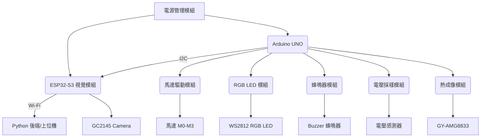

硬體規格書 (Hardware Specification Document) - V4 (重構後)

## 專案概述 (Project Overview)

本專案為一多功能偵防小車，其核心架構經過重構，將網路通訊任務從 Arduino UNO 轉移至 ESP32-CAM，簡化了硬體和軟體設計。

## 硬體功能區塊圖規劃 (Hardware Functional Block Diagram Planning)

## 區塊功能說明

*   **微控制器/MCU (Arduino UNO)**: 核心即時控制器，負責所有感測器讀取和致動器控制，並透過 I2C 與 ESP32 通訊。
*   **視覺暨網路模組 (ESP32-S3)**: 系統的網路代理。負責 Wi-Fi 連線、影像串流、與後端伺服器進行 HTTP 通訊，並作為 I2C 從機與 UNO 交換數據。
*   **通訊介面 - Wireless**: **ESP-01S 模組已被移除**。所有無線通訊由 ESP32-S3 處理。

## 線路腳位定義 (Board Support Package - BSP)

此 BSP 反映了重構後的硬體連接。**移除了對 ESP-01S (UART) 的依賴**。

| 功能類別 | 硬體功能 | 程式碼變數 | 腳位編號 (Pin Number) | 類型 | 備註 |
|---|---|---|---|---|---|
| 指示/警報 | RGB LED | `ledPin` | 2 | 數位輸出 | WS2812 單線控制 |
| | 蜂鳴器 | `buzzerPin` | 3 | 數位輸出 | PWM 控制音調 |
| 致動器 | 馬達 PWM (M0-M3) | `motorpwmPin` | 9, 6, 11, 10 | PWM 輸出 | |
| | 馬達方向 (M0-M3) | `motordirectionPin` | 12, 7, 13, 8 | 數位輸出 | |
| 感測器 | 電壓感測 | `analogRead(A3)` | A3 | 類比輸入 | |
| | **通訊: UNO <-> ESP32** | `SDA`, `SCL` | A4, A5 | I2C | **核心通訊匯流排** |
| | 熱成像 GY-AMG8833 | N/A | I2C (共享) | I2C | 地址 `0x69` |
| | 攝影機 ESP32-S3 | N/A | I2C (共享) | I2C | 地址 `0x53` |
| ~~通訊介面~~ | ~~WIFI (ESP01S)~~ | ~~N/A~~ | ~~UART~~ | ~~N/A~~ | **已被 ESP32-S3 取代** |