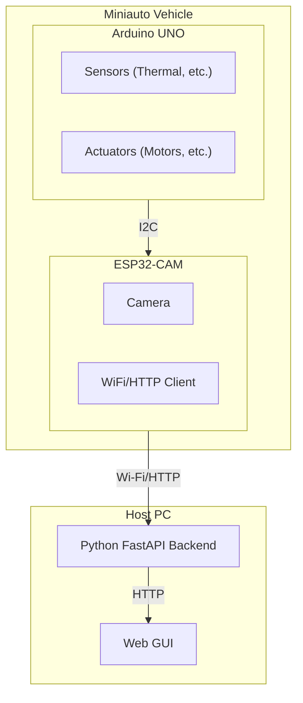

軟體需求書 (Software Requirements Specification, SRS) - V3 (重構後)

## 1. 引言

### 1.1 目的
本文件旨在詳細定義「Miniauto」專案在 **網路架構重構後** 的軟體系統需求。所有網路通訊職責已從 Arduino UNO 轉移至 ESP32-CAM。

### 1.2 範圍
本文件涵蓋嵌入式韌體（Arduino UNO, ESP32-CAM）和上位機 Python 應用程式的所有功能和非功能需求。

## 2. 總體描述

### 2.1 產品視角
本軟體是 Miniauto 系統的核心，其中 **ESP32-CAM 現在作為 Arduino UNO 的網路協同處理器**，負責所有與後端的通訊。

### 2.2 產品功能
*   **車輛運動控制**: 由 UNO 根據從 ESP32 收到的指令執行。
*   **視覺數據處理**: 由 ESP32 採集影像，由後端代理並分析。
*   **感測器數據處理**: 由 UNO 採集，透過 I2C 傳遞給 ESP32，再由 ESP32 發送給後端。
*   **通訊服務**: 由 ESP32 負責 Wi-Fi 連線、服務發現和 HTTP 通訊。

## 3. 特定需求 (Specific Requirements)

### 3.1 硬體介面
*   **Arduino UNO**: 透過 **I2C** 與 ESP32-CAM 介面，交換感測器數據和控制指令。
*   **ESP32-S3 視覺模組**: 作為 **I2C 從機** (地址 `0x53`) 與 UNO 通訊，並作為 **Wi-Fi 客戶端** 與後端通訊。
*   **Wi-Fi 模組 (ESP01S)**: **此硬體已被移除**。

### 3.2 功能需求 (重構後)

#### 3.2.1 Python FastAPI 服務 (FR-PY-API)
*   **FR-PY-API-001 (代理影像)**: 提供一個 HTTP GET API 端點，代理並回傳從 ESP32-CAM 獲取的 MJPEG 影像串流。
*   **FR-PY-API-002 (回報狀態)**: 提供 HTTP GET API 端點，回傳由後端匯總的車輛狀態。
*   **FR-PY-API-003 (接收同步)**: 提供一個 HTTP POST API 端點 (`/api/sync`)，**接收來自 ESP32 的同步數據**，並回傳控制指令。

#### 3.2.2 ESP32-CAM 韌體 (FR-ARD-ESP32)
*   **FR-ARD-ESP32-001 (Wi-Fi 連線)**: 韌體啟動後應自動連接到 Wi-Fi。
*   **FR-ARD-ESP32-002 (影像串流服務)**: 應架設一個 HTTP 伺服器，將捕獲的影像透過 Wi-Fi 串流出去。
*   **FR-ARD-ESP32-003 (後端通訊)**: 
    *   應實現 UDP 客戶端以發現後端伺服器。
    *   應實現 HTTP 客戶端，向後端註冊自身 IP (`/api/register_camera`) 並定期同步數據 (`/api/sync`)。
*   **FR-ARD-ESP32-004 (I2C 從機)**: 
    *   應實現 I2C 從機，用於接收來自 UNO 的感測器數據，並向 UNO 提供從後端獲取的控制指令。

#### 3.2.3 Arduino UNO 主板韌體 (FR-ARD-UNO)
*   **FR-ARD-UNO-001 (I2C 通訊)**: 
    *   韌體應定期透過 I2C 將所有感測器數據（電壓、熱成像、超音波等）發送給 ESP32。
    *   韌體應定期透過 I2C 從 ESP32 請求最新的控制指令。
*   **FR-ARD-UNO-002 (車輛操控)**: 依據從 I2C 接收到的指令，精確控制馬達、LED 和蜂鳴器。
*   **FR-ARD-UNO-003 (移除網路邏輯)**: **所有 Wi-Fi、AT 命令、HTTP 和 JSON 處理相關的程式碼都必須被移除**。