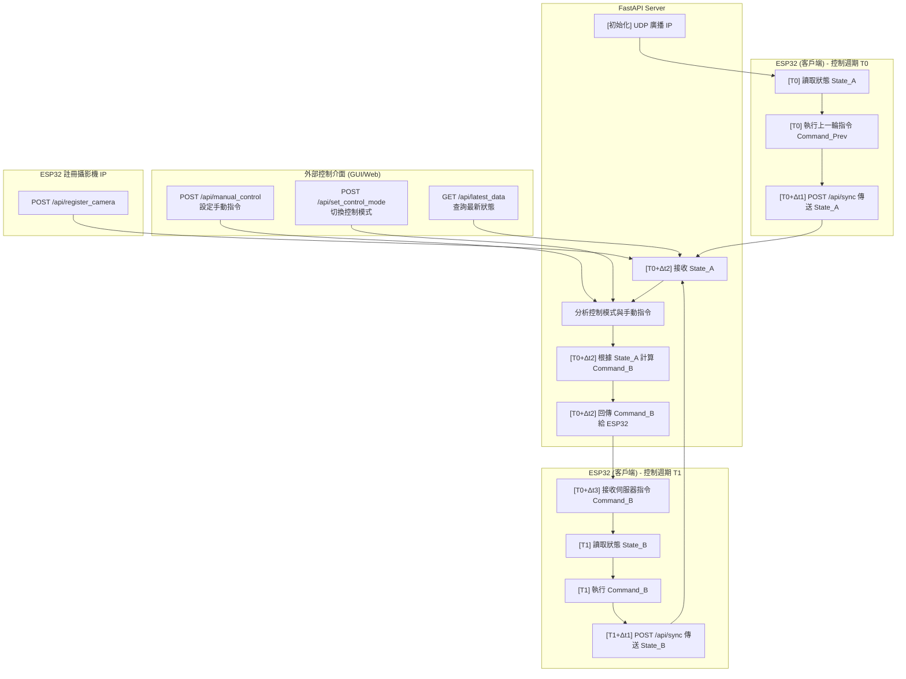

# API 呼叫流程與時間差分析

這份文件旨在詳細解釋 Miniauto 專案中，ESP32 客戶端與 Python FastAPI 伺服器之間的 API 呼叫流程，並特別分析控制指令中的「時間差」概念。

## 1. 整體 API 呼叫流程概述

Miniauto 系統的通訊核心是 ESP32 (作為客戶端) 定期向 Python FastAPI 伺服器 (作為伺服器端) 發送狀態更新並接收控制指令。這種模式確保了車輛狀態的即時性，同時允許伺服器根據最新數據做出決策並下達指令。

### 1.1 主要通訊模式

*   **後端服務發現廣播 (UDP Broadcast)**：後端伺服器在啟動時，會透過 UDP 廣播自己的 IP 位址和埠號，供網路中的客戶端（如 ESP32）進行服務發現。
*   **ESP32 主動同步 (POST /api/sync)**：ESP32 定期將其當前狀態 (例如：狀態字節、電池電壓、熱成像數據、超音波距離) 發送給伺服器。伺服器接收這些數據後，會根據內部邏輯（例如：當前控制模式、手動控制指令、視覺分析結果等）計算出新的控制指令，並將這些指令作為 `/api/sync` 請求的回應發送回 ESP32。
*   **伺服器被動查詢 (GET /api/latest_data)**：外部介面（例如 GUI 或其他監控工具）可以透過此 API 查詢伺服器當前儲存的最新車輛數據、最新發送的指令、ESP32-S3 攝影機的 IP 地址以及當前的控制模式。

### 1.2 其他輔助通訊

*   **ESP32 註冊攝影機 IP (POST /api/register_camera)**：ESP32 在發現後端伺服器 IP 後，會主動向伺服器註冊自身的 IP 地址，以便伺服器知道如何連接到攝影機串流。
*   **設定手動控制指令 (POST /api/manual_control)**：外部介面可以透過此 API 直接設定車輛的手動控制指令（馬達速度、方向、舵機角度、指令字節）。這些指令會被伺服器儲存，並在下一次 `/api/sync` 回應中發送給 ESP32。
*   **切換控制模式 (POST /api/set_control_mode)**：外部介面可以透過此 API 切換車輛的控制模式（手動、避障、自主）。伺服器會根據當前模式來決定如何生成 `/api/sync` 的回應指令。

## 2. 控制指令中的「時間差」概念 (Time Shift)

在 Miniauto 的控制迴圈中，存在一個關鍵的「時間差」或「一週期延遲」：

1.  **ESP32 發送「當前」狀態**：ESP32 執行其當前週期內的感測器讀取和狀態更新，然後將這些「最新」的狀態數據打包，透過 `POST /api/sync` 發送給 FastAPI 伺服器。
2.  **伺服器處理並回應「下一個」指令**：伺服器接收到 ESP32 的「當前」狀態後，會立即進行處理。根據這些數據以及伺服器自身的控制邏輯（例如：手動模式下的預設指令、避障模式下的計算結果），伺服器會生成一組「新的」控制指令。這些指令並不是針對 ESP32 剛剛發送的狀態立即生效的，而是作為 `POST /api/sync` 請求的回應，被 ESP32 在其「下一個」控制週期中接收並執行。

**這意味著：**

*   ESP32 接收到的指令，是伺服器根據 ESP32 **上一個週期**發送的狀態所計算出來的。
*   ESP32 執行這些指令時，其自身的狀態可能已經發生了微小的變化。

這種設計是常見的控制系統模式，它引入了一個固有的延遲。對於大多數非極端即時的應用，這種延遲是可接受的，並且簡化了通訊協議。伺服器始終是根據「過去」的數據來預測和發送「未來」的指令。

### 2.1 範例流程

1.  **T0 時刻**：ESP32 讀取新的感測器數據 (State_A)，執行上一個週期接收到的指令 (Command_Prev)。
2.  **T0 + Δt1 時刻**：ESP32 將 State_A 發送給伺服器 (`POST /api/sync`)。
3.  **T0 + Δt2 時刻**：伺服器接收 State_A，計算出新的指令 (Command_B)，並將 Command_B 作為回應發送回 ESP32。
4.  **T0 + Δt3 時刻**：ESP32 接收到 Command_B。
5.  **T1 時刻 (ESP32 的下一個週期開始)**：ESP32 讀取新的感測器數據 (State_B)，然後執行 Command_B。

在這個流程中，Command_B 是基於 State_A 計算的，但卻在 T1 時刻才被執行，此時 ESP32 的實際狀態已是 State_B。

## 3. 總結

Miniauto 的 API 呼叫流程設計為一種基於請求-回應的同步機制，其中伺服器對客戶端的指令是基於前一個狀態的「預期」指令。理解這種「時間差」對於系統的行為分析和未來控制演算法的設計至關重要。

