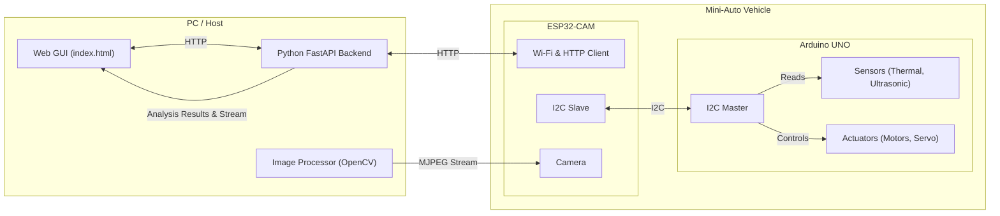

# 系統架構總結

本文件總結了 Miniauto 專案在將網路任務從 Arduino UNO 轉移到 ESP32-CAM 後的系統架構。

## 1. 核心架構

新的系統架構分為三個主要組件，它們之間的通訊流程如下：

**GUI (前端) <--> Python FastAPI (後端) <--> ESP32-CAM (網路代理) <--> Arduino UNO (控制器)**

1.  **Arduino UNO (控制器)**:
    *   **職責**: 專注於即時硬體控制。它負責讀取感測器數據（AMG8833 熱像儀、超音波感測器、電壓感測器）和控制致動器（馬達、舵機、LED、蜂鳴器）。
    *   **通訊**: 作為 I2C 主機，定期將打包好的感測器數據發送給 ESP32，並從 ESP32 請求最新的控制指令。

2.  **ESP32-CAM (視覺模組 & 網路代理)**:
    *   **職責**: 處理所有網路通訊，並作為 UNO 的協同處理器。
        *   **影像**: 捕獲影像並在本地提供 MJPEG 串流。
        *   **網路**: 連接到 Wi-Fi，透過 UDP 廣播發現後端伺服器，向後端註冊自身 IP，並定期與後端的 `/api/sync` 端點同步數據。
    *   **通訊**: 
        *   作為 I2C 從機，與 UNO 交換感測器數據和控制指令。
        *   作為 HTTP 客戶端，與後端 FastAPI 伺服器通訊。

3.  **Python FastAPI (後端)**:
    *   **職責**: 作為中央大腦，處理高級邏輯。
        *   **API 服務**: 提供 RESTful API 供 GUI 和 ESP32 互動。
        *   **影像代理與分析**: 從 ESP32 拉取影像串流，使用 OpenCV 進行分析（如避障），並將處理後的串流和分析結果提供給 GUI。
        *   **控制決策**: 根據從 ESP32 收到的數據和當前控制模式（手動、避障、自主）生成控制指令。

## 2. 通訊流程

*   **啟動**: 後端啟動並廣播其 IP。ESP32 連接 Wi-Fi，接收廣播，找到後端 IP，然後向後端註冊自己。
*   **數據上傳**: UNO 定期透過 I2C 將感測器數據推送到 ESP32。ESP32 將這些數據打包成 JSON，透過 HTTP POST 發送到後端的 `/api/sync`。
*   **指令下達**: 後端根據收到的數據和內部邏輯計算出控制指令，並在 `/api/sync` 的回應中將其發回給 ESP32。ESP32 將這些指令儲存起來。
*   **指令獲取**: UNO 定期透過 I2C 從 ESP32 請求最新的控制指令並執行。
*   **影像**: 後端的影像處理器在收到 ESP32 註冊後，會主動連接到 ESP32 的影像串流。GUI 則連接到後端的影像代理 API (`/api/camera/stream`) 來顯示影像。

## 3. 系統圖

