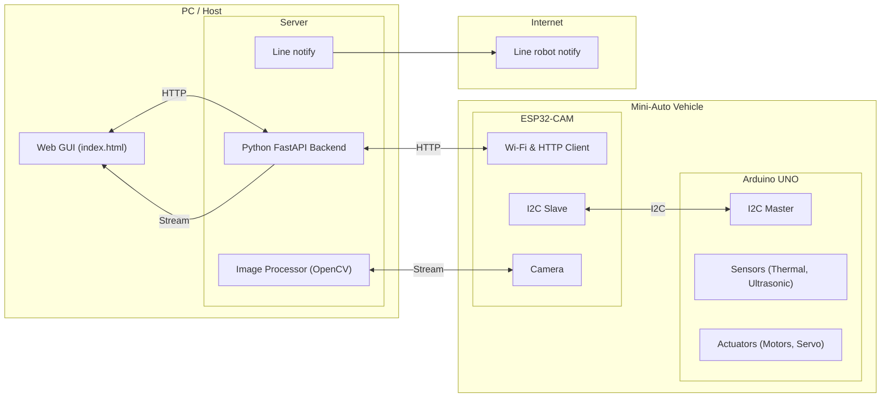

# 系統架構總結

本文件總結了 Miniauto 專案的系統架構，該架構將網路與高階邏輯處理任務從 Arduino UNO 轉移，形成一個分層明確、職責分離的系統。

## 1. 核心架構

新的系統架構分為三個主要組件，它們之間的通訊流程如下：

**GUI (前端) <--> Python FastAPI (後端) <--> ESP32-CAM (網路代理) <--> Arduino UNO (硬體控制器)**

1.  **Arduino UNO (硬體控制器)**:
    *   **核心職責**: 專注於所有即時的底層硬體控制與感測。它直接管理馬達、LED、蜂鳴器，並讀取感測器數據（AMG8833 熱像儀、超音波感測器、電壓感測器）。
    *   **通訊**: 作為 **I2C 主機**，它定期將打包好的感測器數據 (`SensorData_t`) 發送給 ESP32，並從 ESP32 請求最新的控制指令 (`CommandData_t`) 來執行。
    *   **邏輯**: 包含基本的避障邏輯，當從後端接收到 `is_avoidance_enabled` 旗標時，會根據超音波感測器數據自主進行後退。

2.  **ESP32-CAM (網路代理 & 視覺模組)**:
    *   **核心職責**: 作為 UNO 的協同處理器，處理所有網路通訊，並提供即時影像串流。
        *   **網路橋樑**: 連接到 Wi-Fi，透過 UDP 廣播發現後端伺服器，並向後端的 `/api/register_camera` 端點註冊自身 IP。接著，它會定期將從 UNO 收到的感測器數據轉發到後端的 `/api/sync` 端點，並接收控制指令。
        *   **影像服務**: 捕獲攝影機影像，並在本地提供一個 MJPEG 影像串流服務。
    *   **通訊**:
        *   作為 **I2C 從機**，與 UNO 交換 `SensorData_t` 和 `CommandData_t`。
        *   作為 **HTTP 客戶端**，與後端 FastAPI 伺服器進行同步通訊。

3.  **Python FastAPI (後端/大腦)**:
    *   **核心職責**: 作為系統的中央大腦，託管高階應用程式邏輯、API 服務及使用者介面。
        *   **API 服務**: 提供 RESTful API 供 GUI 和 ESP32 互動。關鍵端點包括 `/api/sync`, `/api/manual_control`, `/api/set_control_mode` 等。
        *   **影像代理與分析 (`CameraStreamProcessor`)**: 從 ESP32-CAM 主動拉取 MJPEG 串流，使用 OpenCV 進行即時影像分析（如障礙物偵測），並將原始或標記過的串流代理給前端 GUI。
        *   **控制決策**: 根據從 ESP32 收到的感測器數據、影像分析結果以及前端設定的控制模式（`manual`, `avoidance`, `autonomous`），生成最終的控制指令 (`CommandData_t`)。
        *   **日誌記錄**: 維護一個後端日誌緩衝區，可透過 `/api/logs` 存取。

## 2. 通訊流程

*   **啟動與發現**:
    1.  後端 FastAPI 伺服器啟動，並開始透過 UDP 廣播自身 IP 位址。
    2.  ESP32-CAM 連接至 Wi-Fi，監聽 UDP 廣播以找到後端伺服器。
    3.  找到後端後，ESP32-CAM 將自己的 IP 位址 POST 到後端的 `/api/register_camera` 端點。
    4.  後端收到註冊請求後，停止 UDP 廣播，並啟動 `CameraStreamProcessor` 開始從 ESP32-CAM 的 IP 拉取影像串流。

*   **數據同步迴圈 (Sync Loop)**:
    1.  **UNO -> ESP32**: Arduino UNO 定期讀取所有感測器，將數據封裝進 `SensorData_t` 結構，並透過 I2C 發送給 ESP32。
    2.  **ESP32 -> Backend**: ESP32 的定時器 (`http_sync_callback`) 定期觸發，將最新的 `SensorData_t` 數據以 JSON 格式 POST 到後端的 `/api/sync` 端點。
    3.  **Backend -> ESP32**: 後端 `/api/sync` 端點根據當前的 `current_control_mode` 和收到的感測器數據，計算出 `CommandData_t` 指令，並在 HTTP 回應中將其作為 JSON 返回。
    4.  **ESP32 -> UNO**: ESP32 收到後端的指令後，將其儲存起來。當 UNO 下一次透過 I2C 請求數據時，ESP32 便會將這些最新的指令回傳給 UNO。
    5.  **UNO 執行**: UNO 接收到指令後，立即根據指令內容控制馬達、LED 和蜂鳴器。

*   **使用者控制流程**:
    1.  使用者在前端 GUI 上進行操作（如點擊前進按鈕、切換模式）。
    2.  GUI 透過 JavaScript 向後端的 `/api/manual_control` 或 `/api/set_control_mode` 發送 HTTP 請求。
    3.  後端更新內部狀態變數（如 `current_manual_motor_speed`, `current_control_mode`）。
    4.  在下一次的同步迴圈中，後端會根據這些更新後的狀態變數生成新的指令並發送給車輛。

## 3. 系統圖

