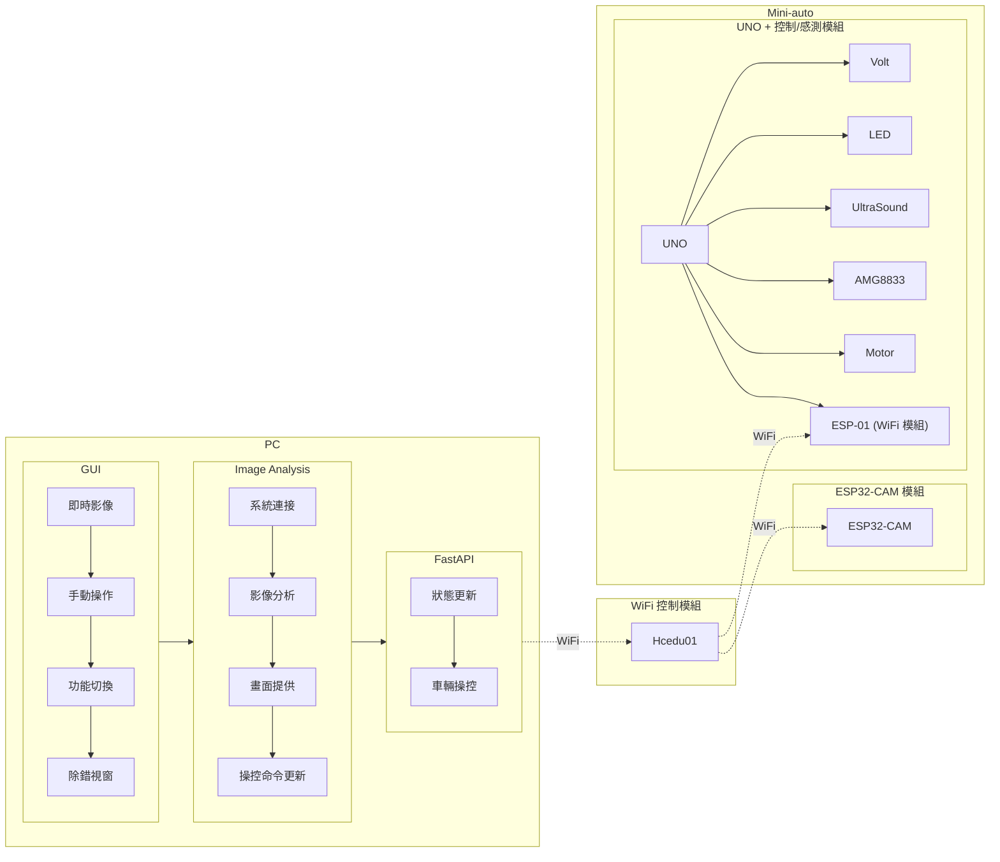

# 系統架構分析：WiFi/API 伺服器與鏡頭模組

這份文件旨在分析和整理目前專案中，關於 WiFi/API 伺服器和 ESP32-S3-CAM 鏡頭模組的架構設計與運作方式。

## 1. WiFi / API 伺服器架構

本專案的 API 伺服器基於 **FastAPI** 框架，並採用了高度模組化的設計，以便於擴展和維護。ESP32 客戶端則負責與該伺服器進行網路通訊。

### 1.1 伺服器端 (Python FastAPI)

*   **核心框架**：使用 `FastAPI`，一個現代、快速 (基於 Starlette 和 Pydantic) 的 Python Web 框架，用於建立 RESTful API。
*   **動態模組載入**：`main.py` 是應用程式的入口點。它會自動掃描 `apis/` 目錄下的所有 Python 檔案 (除了 `__init__.py`)，並動態地匯入它們。每個 API 模組 (例如 `vehicle_api.py`, `camera.py`, `status.py`) 都預期定義一個 `APIRouter` 實例。
*   **路由整合**：`main.py` 會將每個模組中定義的 `APIRouter` 實例包含到主 `FastAPI` 應用程式 `app` 中。這使得新增或修改 API 功能時，只需在 `apis/` 目錄中操作對應的檔案，無需修改 `main.py`。
*   **HTTP 方法**：
    *   **GET 請求**：主要用於從伺服器獲取資訊或指令，例如 `/api/latest_data`、`/api/logs` 等。
    *   **POST 請求**：用於向伺服器提交資料。例如，`/api/sync` 端點允許 ESP32 上傳車輛的狀態資訊。
*   **資料驗證**：對於 POST 請求，FastAPI 利用 `Pydantic` 模型 (如 `SyncRequest`) 自動對傳入的 JSON 資料進行驗證，確保資料格式的正確性。
*   **伺服器運行**：使用 `uvicorn` 作為 ASGI 伺服器來運行 FastAPI 應用程式，預設監聽 `0.0.0.0:8000`，使其可在區域網路中被其他設備訪問。

### 1.2 客戶端 (ESP32)

*   **網路連接**：ESP32 使用 `WiFi` 函式庫連接到指定的無線網路 (SSID 和密碼)。
*   **HTTP 通訊**：使用 `HTTPClient` 函式庫來發送 HTTP 請求。
    *   **發送狀態 (POST)**：`http_sync_callback` 函數會構建一個 JSON 格式的車輛狀態資料 (使用 `ArduinoJson` 函式庫)，並透過 HTTP POST 請求發送到伺服器的 `/api/sync` 端點。
    *   **獲取指令 (GET)**：ESP32 在 `/api/sync` 的回應中直接獲取控制指令。
*   **JSON 處理**：使用 `ArduinoJson` 函式庫來序列化 (POST 請求) 和反序列化 (回應) JSON 資料。

## 2. 鏡頭模組架構 (ESP32-S3-CAM / GC2415)

麥輪小車上的 ESP32-S3-CAM 模組，其鏡頭功能主要依賴於 Espressif 官方的 `esp32-camera` 函式庫來驅動。該函式庫提供了底層的相機控制和圖像獲取功能。

### 2.1 核心函式庫與驅動

*   **`espressif/esp32-camera` 函式庫**：這是用於 ESP32 系列晶片相機支援的官方函式庫。它包含了各種相機感測器的驅動程式和通用的相機介面。
*   **GC2145 驅動 (`gc2145.c`)**：儘管您的鏡頭是 GC2415，但分析顯示 `esp32-camera` 函式庫透過 `gc2145.c` 驅動程式來支援它。這表明 GC2415 通常被視為 GC2145 模組的一部分，或使用其兼容的驅動。
*   **SCCB 介面**：相機感測器 (如 GC2415) 與 ESP32 之間的通訊主要透過 SCCB (Serial Camera Control Bus) 介面進行，這是一種類似 I2C 的串行通訊協定，用於讀寫感測器的內部寄存器。
*   **圖像數據介面**：圖像數據本身則透過專用的數據引腳 (D0-D7)、像素時鐘 (PCLK)、垂直同步 (VSYNC) 和水平參考 (HREF) 引腳傳輸。

### 2.2 相機初始化與配置

*   **`camera_config_t` 結構體**：這是 `esp32-camera` 函式庫中定義的核心配置結構體。它包含了所有初始化相機所需的參數，例如：
    *   **引腳定義**：指定相機的數據引腳 (D0-D7)、SCCB 引腳 (SDA/SCL)、時鐘引腳 (XCLK)、同步引腳 (VSYNC, HREF, PCLK) 等與 ESP32 GPIO 的連接關係。
    *   **時鐘頻率**：設定 XCLK 的頻率 (例如 20MHz)。
    *   **像素格式**：定義圖像的像素格式 (如 `PIXFORMAT_RGB565`, `PIXFORMAT_YUV422`, `PIXFORMAT_JPEG`)。
    *   **幀大小**：設定圖像的解析度 (如 `FRAMESIZE_QVGA`, `FRAMESIZE_UXGA`)。
    *   **幀緩衝區**：配置用於儲存圖像數據的記憶體 (如 PSRAM)。
*   **`esp_camera_init()` 函數**：這是 `esp32-camera` 函式庫提供的核心初始化函數。它接收一個 `camera_config_t` 結構體作為參數，並根據其中的配置來初始化相機感測器和 ESP32 的相機介面。

### 2.3 ESP32-S3-WROOM 引腳配置 (來自 `take_picture.c` 範例)

針對您的 **ESP32-S3-WROOM** 開發板，`take_picture.c` 範例中提供了以下關鍵引腳定義，這些是連接 GC2415 鏡頭的基礎：

```c
#define CAM_PIN_PWDN 38
#define CAM_PIN_RESET -1   // software reset will be performed
#define CAM_PIN_VSYNC 6
#define CAM_PIN_HREF 7
#define CAM_PIN_PCLK 13
#define CAM_PIN_XCLK 15
#define CAM_PIN_SIOD 4     // SCCB SDA
#define CAM_PIN_SIOC 5     // SCCB SCL
#define CAM_PIN_D0 11
#define CAM_PIN_D1 9
#define CAM_PIN_D2 8
#define CAM_PIN_D3 10
#define CAM_PIN_D4 12
#define CAM_PIN_D5 18
#define CAM_PIN_D6 17
#define CAM_PIN_D7 16
```

### 2.4 圖像獲取流程

*   **`esp_camera_fb_get()`**：初始化後，這個函數用於從相機獲取一個圖像幀緩衝區 (`camera_fb_t` 結構體)。該結構體包含了圖像數據的指針 (`buf`) 和數據長度 (`len`)。
*   **`esp_camera_fb_return()`**：獲取圖像後，必須呼叫此函數將幀緩衝區返回給驅動程式，以便重複使用。

## 3. 整合點與未來展望

目前，WiFi/API 伺服器和鏡頭模組是兩個相對獨立的功能模組。未來的整合點將會是：

*   **圖像數據傳輸**：將 ESP32-S3-CAM 獲取的圖像數據，透過 WiFi 傳輸到 Python API 伺服器。這可能涉及到：
    *   將圖像數據 (JPEG 格式) 編碼為 Base64 字串。
    *   在 Python API 伺服器中新增一個端點 (例如 `POST /image_stream`) 來接收這些圖像數據。
    *   考慮即時串流 (Stream) 或定期傳輸。
*   **命令與視覺回饋**：伺服器發送的移動命令可以結合視覺分析結果，實現更智慧的導航和控制。
*   **OpenCV 影像分析**：在 Python 伺服器端接收到圖像後，可以利用 OpenCV 函式庫進行進一步的影像處理和分析，例如目標識別、路徑規劃等，然後將分析結果回傳給 Arduino。

這份架構分析為您提供了當前系統的藍圖，並指明了未來擴展的方向。

