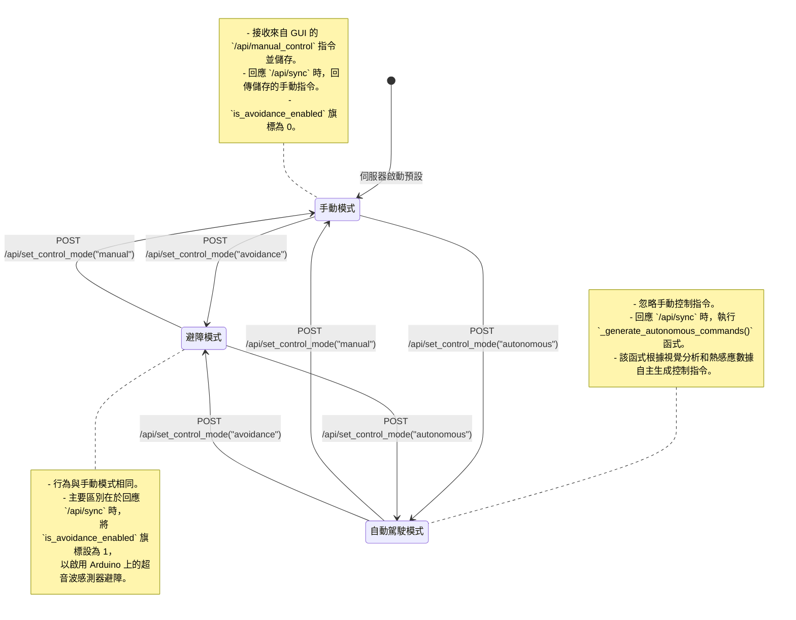

# 後端工作流程與功能解析

本文件詳細說明 Miniauto 專案後端 Python (FastAPI) 服務的內部工作流程、核心功能以及各模組之間的協同運作方式。

## 1. 系統啟動流程

當後端服務啟動時，會執行以下初始化步驟：

1.  **FastAPI 應用程式初始化**: `main.py` 創建 FastAPI 應用實例，並動態載入 `apis/` 目錄下的所有路由模組。
2.  **服務實例化**: `CameraStreamProcessor` 和其他核心服務被實例化，但此時它們處於待命狀態，等待觸發。
3.  **IP 廣播 (可選)**: `main.py` 可以啟動 `broadcast_server_ip.py` 作為子進程，開始在區域網路內廣播後端伺服器的 IP 位址，以便讓車輛硬體進行服務發現。

## 2. 後端控制模式狀態圖

後端的核心邏輯可以被視為一個狀態機，根據前端 GUI 設定的控制模式，其行為會發生改變。下圖描述了這些狀態以及觸發它們之間轉換的 API 呼叫。

## 3. 核心服務與功能

| 模組/類別 | 功能名稱 | 類型 | 描述 |
|---|---|---|---|
| `vehicle_api.py` | `_generate_..._commands` | 內部輔助函數 | 根據當前的控制模式（手動、避障、自主）和所有感測器數據（視覺、熱成像、超音波）生成最終的車輛控制指令。 |
| `camera_stream_processor.py` | `CameraStreamProcessor` | 核心服務類別 | 在一個獨立的背景執行緒中運作，負責： 1. 從 ESP32-CAM 的 IP 位址拉取 MJPEG 影像串流。 2. 使用 OpenCV 進行即時影像分析（如障礙物偵測）。 3. 將原始影像幀、處理後的影像以及分析結果儲存在記憶體中，供 API 層取用。 |
| `vehicle_api.py` | 全域變數 | 狀態儲存 | 使用模組級的全域變數（如 `current_control_mode`, `current_manual_motor_speed`）來儲存從 GUI 收到的最新控制狀態。這是後端與硬體之間非同步通訊的關鍵。 |

## 4. API 端點路由

後端透過 FastAPI 提供一組 RESTful API 來與前端 GUI 和車輛硬體進行互動。

| API 端點 | 方法 | 描述 |
|---|---|---|
| `/api/sync` | `POST` | **[硬體呼叫]** ESP32 定期呼叫此端點，上傳感測器數據並獲取最新的控制指令。 |
| `/api/register_camera` | `POST` | **[硬體呼叫]** ESP32 啟動後呼叫此端點，註冊其 IP 位址。後端收到後會啟動影像處理器。 |
| `/api/manual_control` | `POST` | **[GUI 呼叫]** 接收前端發送的手動控制指令，並更新後端的全域狀態。 |
| `/api/set_control_mode` | `POST` | **[GUI 呼叫]** 接收前端的請求，切換車輛的控制模式 (`manual`, `avoidance`, `autonomous`)。 |
| `/api/latest_data` | `GET` | **[GUI 呼叫]** 提供前端查詢所有最新的車輛數據、指令、IP、模式及分析結果，用於更新儀表板。 |
| `/api/logs` | `GET` | **[GUI 呼叫]** 提供前端查詢後端的日誌緩衝區內容。 |
| `/camera/stream` | `GET` | **[GUI 呼叫]** 提供給前端 `` 標籤的 MJPEG 影像串流代理。 |
| `/camera/analysis` | `GET` | **[GUI 呼叫]** 提供前端查詢最新的視覺分析結果。 |
| `/camera/start` | `POST` | **[GUI 呼叫]** 手動啟動影像串流處理器。 |
| `/camera/stop` | `POST` | **[GUI 呼叫]** 手動停止影像串流處理器。 |
| `/camera/status` | `GET` | **[GUI 呼叫]** 查詢影像串流處理器的運行狀態和 FPS。 |
