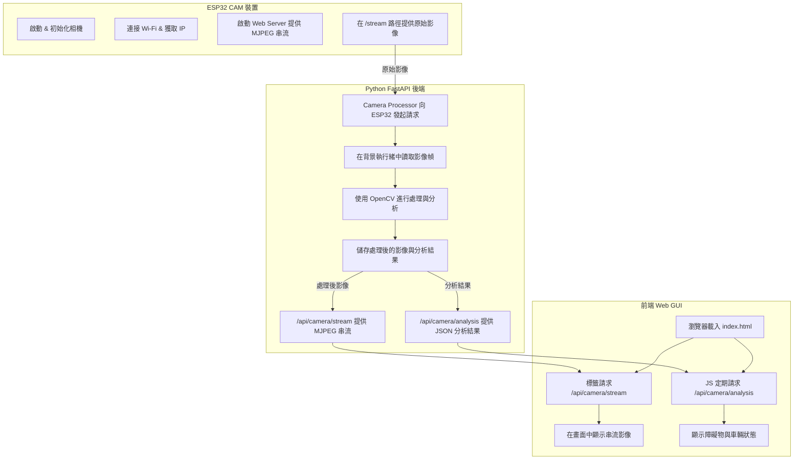

# 影像系統呼叫流程與分析

本文件詳細解釋了 Miniauto 專案中，影像從 ESP32-CAM 產生、經由 Python 後端處理與分析，最終呈現在網頁介面 (GUI) 上的完整呼叫流程與數據傳輸。

這個系統的影像傳輸流程是單向的，並且經過後端處理，可以拆解成三個主要部分：

1.  **ESP32-CAM (影像來源)**
2.  **Python Backend (影像處理、分析與轉發中心)**
3.  **Web GUI (影像顯示端)**

---

### 完整流程說明

這是一個典型的「後端代理串流」架構。這樣設計的好處是，所有複雜的影像處理、數據整合都在後端完成，前端 GUI 只需負責顯示，保持輕量化。

#### 1. ESP32 Camera 端 (影像串流的起點)

*   **程式碼**: `src/miniauto/esp32_cam/esp32_cam.ino`
*   **角色**: 一個獨立的微型 Web Server，負責生成原始 MJPEG 影像串流。
*   **流程**:
    1.  ESP32 啟動後，會初始化相機模組。
    2.  它會連上指定的 Wi-Fi，並獲得一個 IP 位址。
    3.  ESP32 會啟動一個 Web Server，並建立一個特定的串流路徑，例如 `http://<ESP32_IP>/stream`。
    4.  任何時候當有客戶端 (即後端) 連接到這個 `/stream` 路徑時，ESP32 就會開始從相機讀取畫面，並將每一幀影像以 `MJPEG` 格式不斷地發送出去。

#### 2. Python 後端 (FastAPI Server) - 影像處理、分析與代理

*   **程式碼**:
    *   `main.py` (啟動伺服器)
    *   `src/py_rear/apis/camera.py` (提供給前端的 API)
    *   `src/py_rear/services/camera_stream_processor.py` (影像處理與分析核心)
*   **角色**: 系統的中樞，負責從 ESP32 獲取影像、進行分析，並將處理後的影像和分析結果轉發給前端。
*   **流程**:
    1.  **獲取影像**: `camera_stream_processor.py` 會作為一個 **客戶端**，在 ESP32 透過 `/api/register_camera` 註冊其 IP 後，主動去連接 ESP32 的影像串流 URL (`http://<ESP32_IP>/stream`)。它在一個獨立的執行緒中持續讀取影像幀。
    2.  **影像處理與分析**: `camera_stream_processor.py` 會接收從 ESP32 傳來的原始影像幀。接著，它使用 `OpenCV` 對每一幀影像進行加工和分析（例如障礙物偵測）。
    3.  **影像串流代理 (`/api/camera/stream`)**: `camera.py` 中定義了一個 API 端點 `/api/camera/stream`。這個端點會返回一個 `StreamingResponse`，其內容來源就是 `camera_stream_processor.py` **處理過後** 的影像幀。
    4.  **影像分析結果提供 (`/api/camera/analysis`)**: `camera.py` 也提供 `/api/camera/analysis` 端點，供前端定期請求最新的視覺分析結果。

#### 3. 前端 GUI (Vue.js) - 影像顯示與分析結果呈現

*   **程式碼**: `templates/index.html`
*   **角色**: 使用者操作與影像顯示介面。
*   **流程**:
    1.  **影像串流顯示**: HTML 中的 `` 標籤的 `src` 屬性會被設定為 Python 後端的串流 API 路徑: ``。瀏覽器會向後端請求影像，而後端則從 ESP32 拉取並轉發。
    2.  **影像分析結果呈現**: 前端會定期向後端的 `/api/camera/analysis` 端點發送請求，獲取最新的影像分析結果，並在介面上進行顯示。

---

### 總結 Call Flow

**數據流向:**

`ESP32 Camera (原始串流)` -> `Python Backend (Processor)` -> `Python Backend (API)` -> `Web Browser (GUI)`

**呼叫順序:**

1.  **[Backend -> ESP32]**: 後端服務 (`camera_stream_processor`) 主動請求 ESP32 的 `/stream`。
2.  **[ESP32 -> Backend]**: ESP32 開始向後端發送原始影像幀。
3.  **[Backend (Processor) -> Backend (API)]**: 後端處理器對影像進行分析，並將處理後的幀和分析結果提供給後端 API。
4.  **[GUI -> Backend]**: 前端 `` 標籤請求後端的 `/api/camera/stream`，同時前端 JavaScript 定期請求 `/api/camera/analysis`。
5.  **[Backend (API) -> GUI]**: 後端將處理後的影像幀以串流形式轉發給前端 GUI，並將分析結果以 JSON 形式返回給前端。

