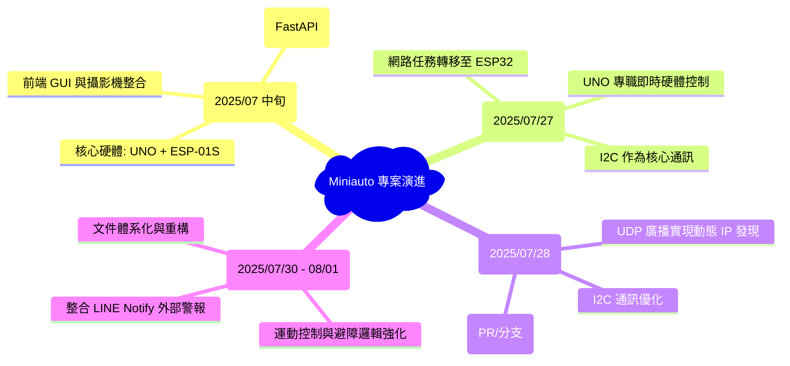

```mermaid
mindmap
  root)Miniauto 專案演進(
    初期架構建立 (2025/07 中旬)
      核心硬體: UNO + ESP-01S
      後端 API 定義 (FastAPI)
      前端 GUI 與攝影機整合
    重大架構重構 (2025/07/27)
      網路任務轉移至 ESP32
      UNO 專職即時硬體控制
      I2C 作為核心通訊
    穩定性與服務發現 (2025/07/28)
      UDP 廣播實現動態 IP 發現
      I2C 通訊優化
      開發流程初步規範 (PR/分支)
    自主能力與外部整合 (2025/07/30 - 08/01)
      運動控制與避障邏輯強化
      整合 LINE Notify 外部警報
      文件體系化與重構
```
