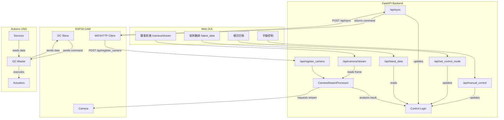

# 後端重要功能分析 (重構後)

這份文件分析了 Miniauto 專案後端 Python 服務在架構重構後的重要功能。

## 1. 重要功能列表

| 模組 | 功能名稱 | 類型 | 描述 |
|---|---|---|---|
| `vehicle_api.py` | `sync_data` | API 端點 (POST) | 接收 **ESP32** 的車輛狀態數據 (從 UNO 透過 I2C 傳來)，並根據控制模式回傳指令。 |
| `vehicle_api.py` | `manual_control` | API 端點 (POST) | 接收 **GUI** 的手動控制指令，並更新後端儲存的參數。 |
| `vehicle_api.py` | `set_control_mode` | API 端點 (POST) | 接收 **GUI** 的控制模式切換請求。 |
| `vehicle_api.py` | `register_camera` | API 端點 (POST) | 接收 **ESP32** 的 IP 地址註冊請求，並啟動影像處理器。 |
| `vehicle_api.py` | `get_latest_data` | API 端點 (GET) | 提供 **GUI** 查詢最新的車輛數據、指令、IP、模式及分析結果。 |
| `vehicle_api.py` | `_generate_..._commands` | 內部輔助函數 | 根據控制模式（手動、避障、自主）和感測器數據（視覺、超音波）生成指令。 |
| `camera.py` | `stream_mjpeg_from_processor` | API 端點 (GET) | 向 **GUI** 提供經處理的 MJPEG 影像串流。 |
| `camera_stream_processor.py` | `CameraStreamProcessor` | 類別 | 核心服務，在背景執行緒中：1. 從 ESP32 拉取影像串流。 2. 使用 OpenCV 進行分析。 3. 將結果儲存起來供其他 API 使用。 |

## 2. 主要 API 呼叫流程圖 (重構後)

