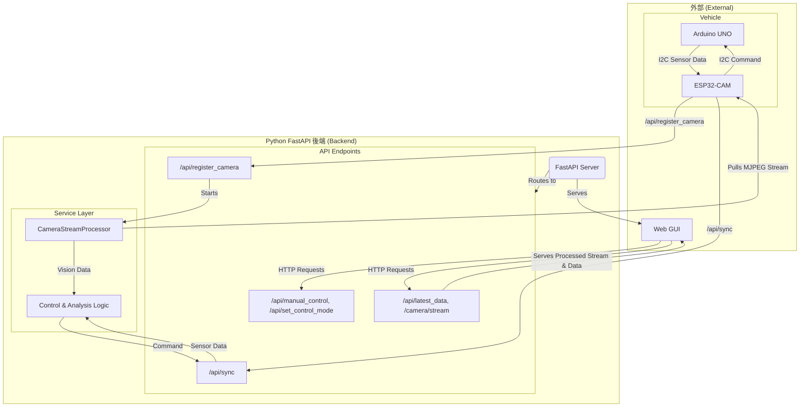

# 後端工作流程分析：伺服器啟動後的協同運作 (重構後)

這份文件旨在詳細分析 Miniauto 專案後端服務 (Py Agent) 在架構重構後，各個核心組件之間是如何協同運作的。

## 1. 伺服器啟動與初始化

1.  **FastAPI 應用程式初始化**: `main.py` 初始化 FastAPI 應用，並動態載入 `apis/` 目錄下的所有路由。
2.  **`CameraStreamProcessor` 初始化**: `services/camera_stream_processor.py` 中的 `CameraStreamProcessor` 實例被創建，但此時它處於待命狀態。
3.  **IP 廣播啟動**: `main.py` 啟動 `broadcast_server_ip.py` 子進程，開始在局域網內廣播後端伺服器的 IP 地址。

## 2. 核心組件間的協同運作

伺服器啟動後，各組件之間的資料流和控制流如下：

### 2.1 ESP32-S3 的啟動與註冊

*   **服務發現**: ESP32-S3 啟動並連上 Wi-Fi 後，會監聽後端的 UDP 廣播，從而發現後端伺服器的 IP。
*   **註冊攝影機 IP (`POST /api/register_camera`)**: ESP32-S3 發現後端後，會立即向後端發送 `POST /api/register_camera` 請求，將其 IP 地址告知後端。
*   **影像串流啟動**: 後端接收到註冊請求後，會更新 `CameraStreamProcessor` 實例的串流來源 (`update_stream_source`)，並自動啟動影像串流處理器 (`start()`)。`CameraStreamProcessor` 會在一個獨立的執行緒中，開始從 ESP32 的 MJPEG 串流 (`http://<ESP32-S3_IP>/stream`) 拉取影像幀並使用 OpenCV 進行分析。
*   **停止廣播**: 註冊成功後，後端會停止 IP 廣播的子進程。

### 2.2 UNO-ESP32-FastAPI 的數據同步 (`POST /api/sync`)

*   **數據流**: `UNO (感測器) -> I2C -> ESP32 -> Wi-Fi/HTTP -> FastAPI`
*   **UNO -> ESP32**: Arduino UNO 定期讀取所有感測器數據，打包成 `SensorData_t` 結構，並透過 I2C 將其發送給 ESP32。
*   **ESP32 -> FastAPI**: ESP32 在其獨立的計時器 (`esp_timer`) 驅動下，定期將從 UNO 收到的最新感測器數據打包成 JSON，透過 `POST /api/sync` 發送給後端。
*   **後端處理**: 後端的 `/api/sync` 端點接收到數據後，會進行熱成像分析，並根據當前的控制模式和所有感測器數據（包括視覺分析結果）生成新的控制指令。
*   **指令回傳**: 生成的控制指令會作為 `/api/sync` 請求的回應，以 JSON 格式發送回 ESP32。ESP32 會將這些指令儲存在 `currentCommandData` 變數中，等待 UNO 透過 I2C 來讀取。

### 2.3 GUI 與後端的互動

*   **控制指令**: GUI 透過 `/api/manual_control` 和 `/api/set_control_mode` 來設定手動指令和切換控制模式。
*   **數據獲取**: GUI 定期呼叫 `/api/latest_data` 來獲取車輛的最新全維度狀態。
*   **影像獲取**: GUI 的 `` 標籤直接指向後端的 `/api/camera/stream`，以顯示由後端代理並處理過的即時影像。

## 3. 後端工作流程圖 (重構後)

