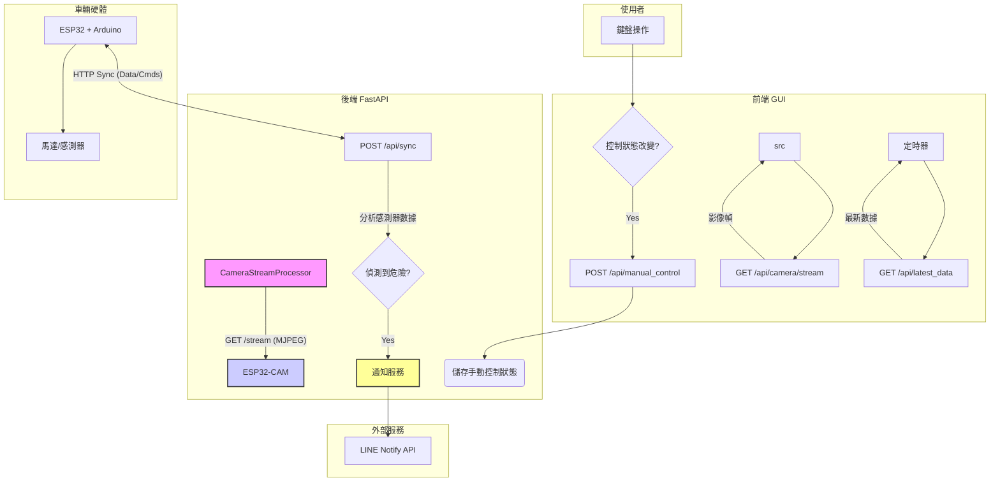
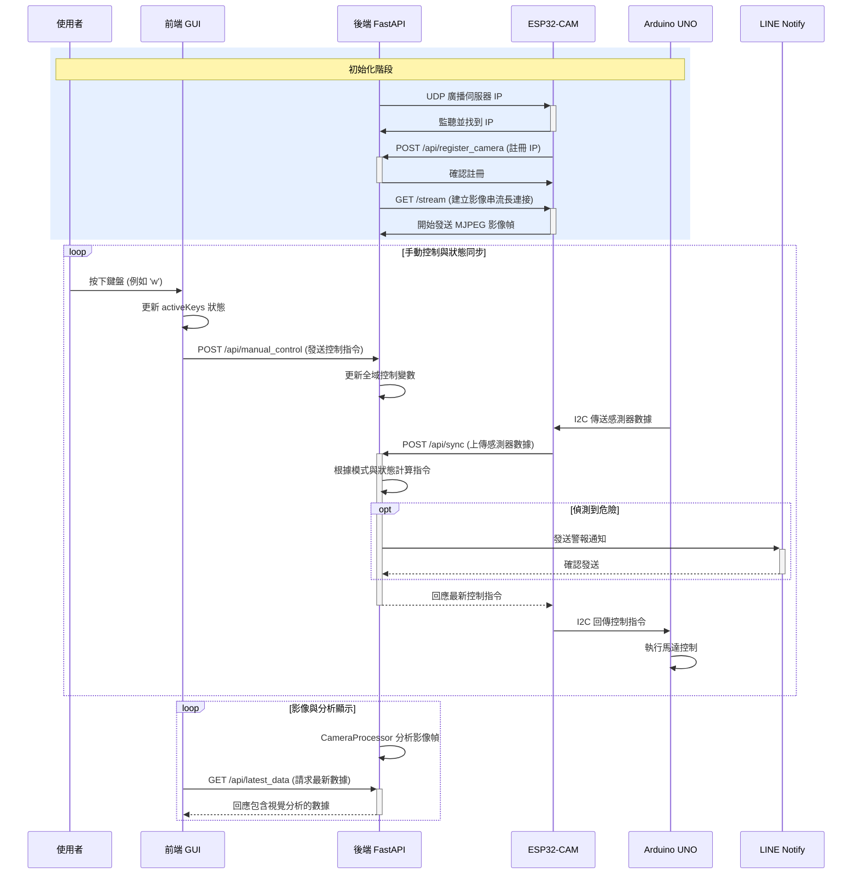

# 系統呼叫流程與資料同步

本文件詳細解釋了 Miniauto 專案中，從前端 GUI 操作到硬體執行的完整 API 呼叫流程，並涵蓋了影像串流、分析、LINE 通知以及關鍵的「時間差」同步概念。

```mermaid
block-beta
  block:scope:User Space {
    block:gui["前端 GUI (Vue.js)"]
  }
  block:scope:Backend Server {
    block:api["FastAPI Server"]
    block:cam["Camera Processor (OpenCV)"]
    block:notify["Notification Service"]
  }
  block:scope:Vehicle Hardware {
    block:esp["ESP32-CAM"]
    block:uno["Arduino UNO"]
  }
  block:scope:External Services {
    block:line["LINE Notify API"]
  }

  gui -- "控制指令 (HTTP)" --> api
  api -- "控制指令 (Sync)" --> esp
  esp -- "控制指令 (I2C)" --> uno
  uno -- "感測器數據 (I2C)" --> esp
  esp -- "感測器數據 (HTTP)" --> api

  esp -- "MJPEG 影像串流" --> cam
  cam -- "分析結果" --> api
  api -- "代理串流/分析結果" --> gui

  api -- "觸發警報" --> notify
  notify -- "發送通知 (HTTP)" --> line
```

## 1. 核心架構與通訊模式

系統採用分層架構，各元件職責明確。後端與 ESP32 之間存在兩種不同的 HTTP 連線：

1.  **指令同步 (Request/Response)**: ESP32 定期向後端 `/api/sync` 發送 POST 請求，上傳感測器數據並獲取控制指令。這是一種短連接。
2.  **影像串流 (Streaming)**: 後端主動向 ESP32 的 `/stream` 端點發起 GET 請求，以獲取一個持續的 MJPEG 影像串流。這是一種長連接。

## 2. 主要呼叫流程

#### 2.1 手動控制流程

1.  **前端 -> 後端**: 使用者在 GUI 上按下按鍵。前端**僅在控制狀態改變時**，向後端的 `/api/manual_control` 端點發送 `POST` 請求。
2.  **後端儲存狀態**: 後端 API 接收到請求後，**僅更新內部的全域狀態變數**。它**不會**主動將指令推播給硬體。
3.  **硬體同步**: 車輛硬體（由 ESP32 主導）以固定頻率（如 200ms）向後端的 `/api/sync` 端點發送 `POST` 請求，上傳其最新的感測器數據。
4.  **後端回應指令**: 後端的 `/api/sync` 函式被觸發。它會讀取儲存的全域控制狀態，將其封裝成 `SyncResponse` JSON 物件，並在 HTTP 回應中將其發送回 ESP32。
5.  **指令執行**: ESP32 透過 I2C 將指令傳遞給 Arduino，由 Arduino 最終驅動馬達執行。

#### 2.2 影像串流與分析流程

此流程與控制流程平行運作：

1.  **ESP32-CAM**: 在本地 `http://<esp32_ip>/stream` 提供 MJPEG 影像串流。
2.  **後端影像處理器**: `CameraStreamProcessor` 在背景執行緒中，持續從 ESP32 的串流 URL 拉取影像幀，並使用 OpenCV 進行即時分析（如障礙物偵測）。
3.  **前端顯示**: GUI 的 `` 標籤的 `src` 指向後端的 `/api/camera/stream`，後端作為代理將處理後的影像轉發給前端。同時，GUI 定期請求 `/api/latest_data` 以獲取最新的視覺分析結果。

#### 2.3 事件驅動的 LINE 通知流程

1.  **後端數據分析**: 在 `/api/sync` 端點，後端每次收到硬體的感測器數據時，都會進行分析（如熱像儀溫度檢查）。
2.  **觸發與發送**: 如果分析結果滿足危險條件（如高溫），後端會立即觸發通知服務，向 LINE Notify API 發送 HTTP POST 請求，將警報推播給使用者。

## 3. 控制指令的「時間差」概念 (Time Shift)

系統的控制迴圈存在一個關鍵的「一週期延遲」：ESP32 接收到的指令，是後端根據它**上一個週期**發送的狀態所計算出來的。在設計高階控制演算法時必須考慮這個固有的延遲。

## 4. 系統完整流程圖



## 5. 系統時序圖


